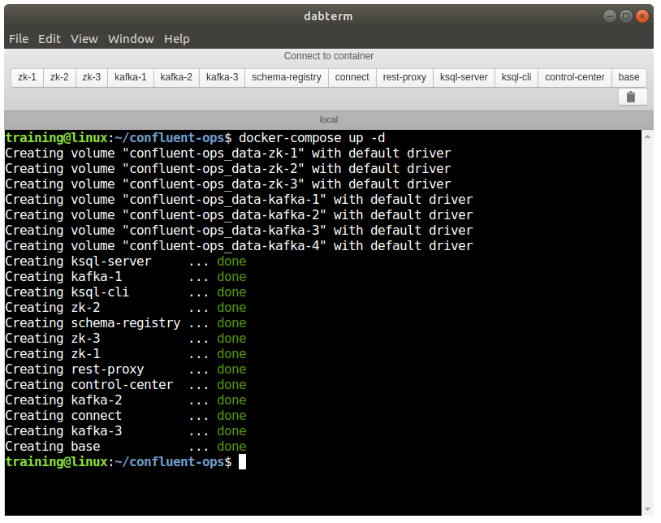

## dabterm - Docker Tab Term

The idea: a terminal that detects your running docker containers and creates a tab for each with an `exec bash`.

To do:

* Not all containers have `base`, or are configured with an `entry-point`, how to detect that?  Or just display the list of containers, and make it a user action to `exec`, or move to configuration?
* [node-docker-api](https://www.npmjs.com/package/node-docker-api) to find all the containers, and update the UI when containers stop / killed / start.
* Switch to a neater framework like react / angularjs.
* Make the UI more like an app:
  * http://photonkit.com/components/ or https://ant.design/
  * Menus that make sense
  * Resize the terminal window with app resize

